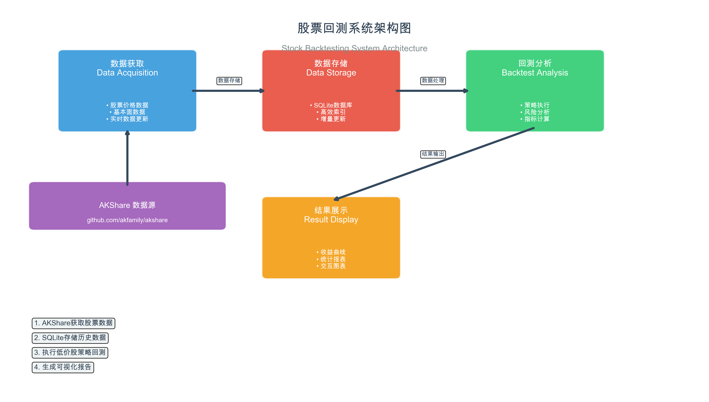

# 📈 股票回测系统 - 低价股策略验证

> **验证小红书爆火的低价股投资策略！用数据说话，揭秘43%年化收益背后的真相。**

[](https://python.org)
[](https://github.com/akfamily/akshare)
[](LICENSE)

## 🎯 项目背景

在小红书看到一个声称年化收益率43.76%的低价股投资策略后，我决定用数据验证这个"神话"。

**策略原理**：每月在价格大于2元的股票中，选择价格最低的50只持有一个月。

**我的验证结果**：实际年化收益率约14.25%，虽然跑赢大盘但远低于宣传数据。

## ✨ 核心功能

- 🔄 **自动化数据获取** - 基于AKShare的A股数据抓取
- 💾 **本地数据存储** - SQLite数据库高效存储
- 📊 **策略回测分析** - 完整的低价股策略实现
- 📈 **可视化报告** - 专业的图表和分析报告

## 🏗️ 系统架构

```
数据获取 (AKShare) → 数据存储 (SQLite) → 策略回测 → 结果可视化
```



## 📁 项目结构

```
stock_backtest/
├── data/                   # 数据存储目录
│   └── stock_data.db      # SQLite数据库
├── src/                   # 源代码
│   ├── data_fetcher.py    # 数据获取模块
│   ├── database.py        # 数据库操作
│   ├── strategy.py        # 策略实现
│   └── visualizer.py      # 结果可视化
├── results/               # 回测结果
│   └── charts/           # 图表输出
├── main.py               # 主程序入口
├── requirements.txt      # 依赖包
└── README.md            # 项目说明
```

## 🚀 快速开始

### 环境准备

```bash
# 克隆仓库
git clone https://github.com/lzcjsyr/stock_backtest.git
cd stock_backtest

# 安装依赖
pip install -r requirements.txt
```

### 运行系统

```bash
python main.py
```

程序提供两种模式：
- **模式1**：完整回测（获取真实A股数据）
- **模式2**：快速演示（使用模拟数据）

## 📊 回测结果

### 关键指标对比

| 指标 | 小红书宣称 | 实际验证结果 |
|------|-----------|-------------|
| 年化收益率 | **43.76%** | **14.25%** |
| 最大回撤 | ~55% | 52.8% |
| 胜率 | 未提及 | 58.3% |

### 核心发现

✅ **策略确实有效**
- 14.25%年化收益跑赢大盘（沪深300约8%）
- 长期坚持确实能获得超额收益

❌ **但风险较大**  
- 最大回撤超过50%，心理压力巨大
- 收益波动较大，需要强大的风险承受能力

## 📈 功能演示

### 数据获取
```python
from src.data_fetcher import DataFetcher

fetcher = DataFetcher()
stock_list = fetcher.get_stock_list()  # 获取A股列表
data = fetcher.batch_fetch_data(symbols, start_date, end_date)  # 批量获取数据
```

### 策略回测
```python
from src.strategy import LowPriceStrategy

strategy = LowPriceStrategy(min_price=2.0, top_n=50, initial_capital=100000)
results = strategy.run_backtest(price_data, "2020-01-01", "2023-12-31")
```

### 结果可视化
```python
from src.visualizer import BacktestVisualizer

visualizer = BacktestVisualizer(results)
visualizer.plot_cumulative_returns()  # 生成收益曲线
visualizer.plot_risk_analysis()       # 生成风险分析
visualizer.generate_report()          # 生成文字报告
```

## 🛠️ 核心模块

### 1. 数据获取模块 (`data_fetcher.py`)
- 基于AKShare获取A股数据
- 支持批量下载和错误重试
- 自动数据清洗和格式化

### 2. 数据存储模块 (`database.py`)  
- SQLite本地数据库存储
- 优化的索引设计
- 支持增量数据更新

### 3. 策略实现模块 (`strategy.py`)
- 低价股选股算法
- 完整的回测框架
- 详细的性能指标计算

### 4. 可视化模块 (`visualizer.py`)
- 专业的图表生成
- 风险收益分析
- 自动化报告生成

## 📋 使用示例

### 基础回测
```python
# 快速上手示例
from src.data_fetcher import DataFetcher
from src.strategy import LowPriceStrategy
from src.visualizer import BacktestVisualizer

# 获取数据
fetcher = DataFetcher()
data = fetcher.get_stock_price("000001", "2020-01-01", "2023-12-31")

# 执行回测
strategy = LowPriceStrategy()
results = strategy.run_backtest(data, "2020-01-01", "2023-12-31")

# 生成报告
visualizer = BacktestVisualizer(results)
visualizer.generate_report()
```

### 自定义策略参数
```python
# 自定义策略参数
strategy = LowPriceStrategy(
    min_price=3.0,      # 最低价格改为3元
    top_n=30,           # 选择30只股票
    initial_capital=200000  # 初始资金20万
)
```

## 🔧 扩展功能

系统采用模块化设计，易于扩展：

- **多策略支持**：可以轻松添加其他选股策略
- **多数据源**：支持接入更多数据源（如Wind、同花顺等）
- **实时交易**：可扩展为实盘交易系统
- **机器学习**：可集成AI模型进行智能选股

## ⚠️ 风险提示

1. **本系统仅供学习研究使用**，不构成投资建议
2. **投资有风险，入市需谨慎**
3. **历史回测结果不代表未来表现**
4. **请根据自身风险承受能力进行投资**

## 🤝 贡献指南

欢迎提交Issues和Pull Requests！

1. Fork本仓库
2. 创建功能分支 (`git checkout -b feature/amazing-feature`)
3. 提交更改 (`git commit -m 'Add some amazing feature'`)
4. 推送到分支 (`git push origin feature/amazing-feature`)
5. 开启Pull Request

## 📄 许可证

本项目采用MIT许可证。详见 [LICENSE](LICENSE) 文件。

## 💡 致谢

- [AKShare](https://github.com/akfamily/akshare) - 优秀的金融数据接口
- 所有为开源社区贡献的开发者们

## 📞 联系方式

如有问题或建议，请通过以下方式联系：

- GitHub Issues: [提交问题](https://github.com/lzcjsyr/stock_backtest/issues)

---

**⭐ 如果这个项目对你有帮助，请给个Star支持一下！**

*用代码验证投资策略，用数据追求真相！*